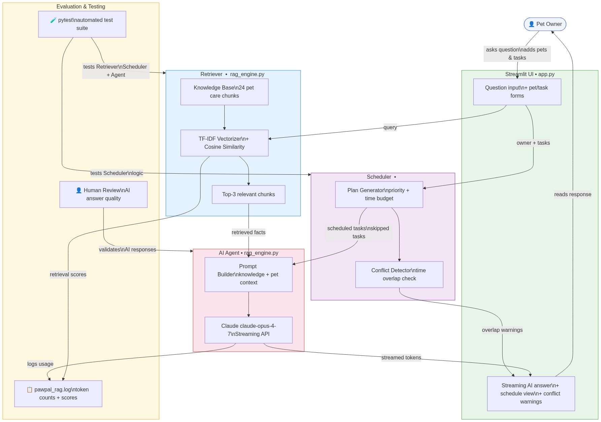

# PawPal+ — AI-Powered Pet Care Scheduler

PawPal+ is a full-stack Python application that helps pet owners build and manage a daily care schedule for their pets. It combines a priority-based task scheduler with a Retrieval-Augmented Generation (RAG) AI that answers pet care questions using a curated knowledge base and the owner's live schedule data.

## Architecture Overview



PawPal+ is organized into five components that work together to produce a personalized pet care schedule and AI-powered answers.

**Streamlit UI** (`app.py`) is the entry point. The owner enters their pets, tasks, and time budget here, then asks questions in natural language. The UI feeds input downstream and streams the AI response back to the screen in real time.

**Retriever** (`knowledge_base.py` + `rag_engine.py`) holds 24 curated pet care knowledge chunks. When a question is asked, it is converted to a TF-IDF vector and compared against every chunk using cosine similarity. The three highest-scoring chunks are passed to the AI as grounding context, keeping answers accurate and specific without requiring a live internet search.

**AI Agent** (`rag_engine.py`) combines the retrieved knowledge with the owner's live pet data — names, species, current tasks, and today's schedule — into a single prompt. It then calls the Gemini API and streams the response token-by-token back to the UI, producing an answer that is both evidence-based and personalized.

**Scheduler** (`pawpal_system.py`) handles all task planning logic independently of the AI. It generates a priority-ordered daily plan within the owner's time budget, detects time-window conflicts between tasks, and auto-creates the next occurrence when a recurring task is marked complete.

**Evaluation & Testing** is the human and automated quality layer. The `pytest` suite (49 tests) verifies the scheduler, retriever, and prompt-builder logic automatically. The `pawpal_rag.log` file records every API call with token counts and retrieval scores so AI behavior can be audited. Human review of AI responses is the final check — the knowledge sources expander in the UI shows exactly which chunks the AI used for each answer.

---

## Scenario

Pet owners need help staying consistent with pet care. PawPal+ helps them by:

- Scheduling pet care tasks (walks, feeding, meds, enrichment, grooming, etc.)
- Considering constraints (time available, priority, owner preferences)
- Producing a daily plan
- Allowing the user to ask AI questions about pet care and get responses grounded in a curated knowledge base


## Features

- **Priority-based scheduling** — Tasks are ranked by `required` status first, then by priority level (1–5). Required tasks always claim time slots before optional ones, regardless of priority score.
- **Bin-packing plan generation** — The scheduler never stops early when a task doesn't fit. It continues iterating so smaller lower-priority tasks can fill leftover minutes after a large task is skipped.
- **Chronological sorting** — `sort_by_time` converts `"HH:MM"` strings to total minutes before comparing, avoiding lexicographic pitfalls (e.g. `"9:00"` incorrectly sorting after `"13:30"`). Tasks with no start time are grouped at the end.
- **Task filtering** — `filter_tasks` accepts an optional pet name and/or completion status and combines them with AND logic, making it easy to show one pet's incomplete tasks or a full cross-pet to-do list.
- **Daily and weekly recurrence** — Marking a task complete automatically creates the next occurrence with a computed `due_date` (`timedelta(days=1)` or `timedelta(weeks=1)`). Python's `timedelta` handles month and year rollovers automatically.
- **Conflict detection** — Every pair of scheduled timed tasks is checked using the interval-overlap formula `A.start < B.end AND B.start < A.end`. Conflicts are reported with scope (`same pet` or `different pets`); tasks without a start time produce a warning instead of a false negative.
- **Task deduplication** — `get_all_tasks` tracks seen IDs across all pets so a task shared between pets is never double-scheduled.
- **Plan cache with dirty flag** — The generated plan is cached and only recomputed when tasks are added, removed, or marked complete. This avoids redundant sorting passes on every UI rerender.
- **Editable tasks** — Any task field (title, duration, priority, required, frequency, start time) can be updated in place through the UI. The cache is invalidated immediately so the next schedule generation reflects the change.
- **Conflict warnings in the UI** — Overlapping tasks surface as `st.warning` banners with task names, time windows, and a plain-language fix suggestion. Missing start times appear as `st.info` notices so the owner knows what still needs to be checked.

---

## Smarter Scheduling

The `Scheduler` class goes beyond a basic priority sort. Here is a summary of the features added incrementally:

### Task sorting
`sort_by_time(tasks)` orders any list of tasks by their `start_time` field (`"HH:MM"` format). Times are converted to total minutes since midnight before comparing, so `"9:00"` correctly sorts before `"13:30"`. Tasks with no `start_time` are placed at the end.

### Task filtering
`filter_tasks(pet_name, completed)` returns a subset of tasks across all pets. Both parameters are optional and combine with AND logic:
- `filter_tasks(completed=False)` — incomplete tasks only (today's to-do list)
- `filter_tasks(pet_name="Buddy")` — all tasks for one pet
- `filter_tasks(pet_name="Buddy", completed=True)` — Buddy's completed tasks only

### Recurring tasks
Tasks have a `frequency` field (`"daily"` or `"weekly"`). Calling `mark_task_complete(task_id)` marks the task done and automatically creates the next occurrence with a new `due_date` computed using Python's `timedelta`:
- Daily tasks: `due_date = today + timedelta(days=1)`
- Weekly tasks: `due_date = today + timedelta(weeks=1)`

The new task is added to the same pet's list and carries over all original fields (priority, duration, start time).

### Conflict detection
`detect_conflicts()` checks every pair of scheduled timed tasks for overlapping time windows using the interval-overlap formula `A.start < B.end AND B.start < A.end`. It returns a list of plain-text warning strings — never raises an exception — so the caller decides how to surface them. Each warning is prefixed:
- `CONFLICT (same pet)` — two of the same pet's tasks overlap
- `CONFLICT (different pets)` — tasks from different pets overlap
- `WARNING` — a task has no `start_time` and could not be checked

An empty list means the schedule is conflict-free.

### Plan generation
`generate_plan()` applies a multi-constraint scheduling strategy in one sorted pass:
1. Required tasks are guaranteed slots before optional ones
2. Incomplete tasks rank above already-completed ones (carrying forward unfinished work)
3. Within those groups, tasks are ordered by priority (1–5)
4. A bin-packing approach fills leftover minutes with smaller tasks rather than stopping at the first task that does not fit

Returns `(scheduled_tasks, skipped_tasks)` so both what fit and what did not can be shown to the owner.

---

## Design Decisions

### RAG over fine-tuning or pure prompting

The AI layer uses Retrieval-Augmented Generation rather than a fine-tuned model or a plain system prompt. Fine-tuning requires labeled training data, a GPU, and retraining every time the knowledge base changes — none of which are practical for a course project. A pure system prompt stuffed with all 24 knowledge chunks would work but wastes tokens on every call regardless of relevance. RAG retrieves only the chunks that match the question, keeping prompts short and responses focused. The trade-off is added complexity in the retrieval layer, but that complexity is contained entirely in `rag_engine.py`.

### TF-IDF over vector embeddings

The retriever uses scikit-learn's `TfidfVectorizer` with cosine similarity instead of a vector database like ChromaDB or an embedding API. TF-IDF runs entirely in memory, requires no model downloads, no API calls, and no external services — the index is built in milliseconds at startup from a plain Python list. The trade-off is semantic understanding: TF-IDF matches on word overlap, so a question phrased very differently from the knowledge base may miss a relevant chunk. For a 24-chunk knowledge base covering predictable pet care topics this is an acceptable trade-off. A production system with thousands of chunks and diverse phrasing would benefit from embeddings.

### Streaming responses

The AI answer streams token-by-token to the UI using `st.empty()` with a live cursor rather than waiting for the full response before displaying anything. This makes the app feel responsive even when the model takes several seconds to generate a long answer. The trade-off is that streaming requires more code than a single blocking API call, and the cursor `▌` must be manually managed.

### Live pet context injected at query time

Every AI call includes a plain-text summary of the owner's actual pets, tasks, and today's schedule built fresh from Streamlit session state. This is what allows the AI to say "since Blue already has a feeding task scheduled" rather than giving a generic answer. The trade-off is that the context string grows with the number of pets and tasks, consuming more input tokens on each call.

### Scheduler separated from the UI

All scheduling logic lives in `pawpal_system.py` with no Streamlit imports. The UI in `app.py` calls into it, but the scheduler has no knowledge of the UI. This separation made the 49-test suite straightforward to write — tests instantiate `Scheduler` directly without needing to mock any Streamlit state. The trade-off is slightly more code to wire the two layers together in `app.py`.

### Plan cache with dirty flag

The scheduler caches its generated plan and only recomputes it when tasks are added, edited, or marked complete. Streamlit reruns the entire script on every user interaction, so without caching the plan would be regenerated on every button click, slider move, and text input. The dirty flag keeps the cache coherent without requiring manual invalidation everywhere — any mutation method calls `_invalidate_cache()` internally.

### In-memory session state, no database

Owner, pet, and task data lives in `st.session_state` for the duration of a browser session and is not persisted to a file or database. This keeps the app dependency-free and easy to run locally, which fits the scope of the project. The trade-off is that refreshing the browser resets all data. A production version would persist to SQLite or a cloud database.

---

## Sample Interactions

The following examples show real conversations with the PawPal+ AI. Each response is grounded in the knowledge base and personalized using the owner's current pets and scheduled tasks.

---

### Interaction 1

**Prompt:**
> How much exercise does my dog require?

**Response:**
> Blue, your dog, requires a significant amount of exercise to stay happy and healthy. Based on general guidelines, small breeds typically need about 30 minutes of daily physical activity, medium breeds 45-60 minutes, and large breeds 60-90 minutes. High-energy breeds might even need over two hours! This exercise should include a mix of walks, playtime, and safe off-leash opportunities. Without enough physical activity, dogs can develop behavioral issues such as destructive chewing or excessive barking.

---

### Interaction 2

**Prompt:**
> What shots or medications does Blue need?

**Response:**
> To determine Blue's specific vaccination needs, I would need a bit more information about his age and lifestyle. Puppies require a series of vaccinations, typically starting between 6-8 weeks old and continuing with boosters every 3-4 weeks until they are 16 weeks old. These core vaccines protect against serious diseases like distemper, parvovirus, adenovirus, and rabies. Adult dogs need booster shots, usually annually or every 1-3 years, depending on the vaccine and local regulations.
>
> Beyond the core vaccines, some non-core vaccines might be recommended for Blue based on his lifestyle and potential exposure risks. This could include vaccines for Bordetella (kennel cough), Leptospirosis, or Lyme disease, especially if Blue socializes with other dogs frequently, travels to wooded areas, or lives in a region where these diseases are common. To get a definitive list of what Blue needs, please consult your veterinarian. They can assess his individual risk factors and provide a tailored vaccination plan.

---

### Interaction 3

**Prompt:**
> What human foods should Blue not be allowed to have?

**Response:**
> Giovanni, it's great you're thinking about what's safe for Blue! Many human foods can be harmful or even toxic to dogs.
>
> Some of the most common human foods that dogs should never have include chocolate, grapes and raisins, onions, garlic, xylitol (an artificial sweetener often found in sugar-free gum and candy), avocado, macadamia nuts, and alcohol. These can cause a range of health issues from upset stomachs to severe poisoning, seizures, and even death. It's best to stick to high-quality dog food and treats specifically formulated for canine consumption.
>
> Since Blue already has a feeding task scheduled, you can ensure his meals and any approved treats are the only things he consumes. If you ever suspect Blue has eaten something he shouldn't have, please contact your veterinarian immediately.

---

## Testing PawPal+

### Running the tests

```bash
python -m pytest tests/test_pawpal.py -v
```

### What the tests cover

The suite contains 49 tests organized into five areas:

- **Happy paths** — all tasks fit within the budget, required tasks are scheduled before optional ones, and `explain_plan` lists both scheduled and skipped tasks.
- **Sorting correctness** — `sort_by_time` returns tasks in chronological order; tasks without a `start_time` are placed at the end.
- **Recurrence logic** — completing a daily task creates a new task due the next day; weekly tasks advance by 7 days; one-off tasks return `None`; unknown IDs raise `ValueError`.
- **Conflict detection** — overlapping tasks produce `CONFLICT` strings; adjacent (non-overlapping) tasks do not; tasks missing `start_time` produce `WARNING` strings; a clean schedule returns an empty list.
- **Edge cases** — pet with no tasks, zero-budget owner, task duration exactly equal to budget, duplicate task IDs across pets, and cache invalidation after mutations.

### Results

49 out of 49 tests pass across all components. The scheduler, conflict detection, recurrence logic, and edge cases are fully covered by 45 unit tests. Four dedicated RAG engine tests confirm that the retriever returns relevant knowledge chunks for real pet care queries, returns an empty result when no match exists, and assembles the AI prompt with all required sections. No test failures were observed; the only gap is UI-layer behavior, which is evaluated manually.

### Logging and error handling

Every AI query is logged to `pawpal_rag.log` with the question text, number of chunks retrieved, cosine similarity scores for each chunk, and the final token counts (input and output) from the Gemini API. During development, two rate limit errors were caught and surfaced as plain-language messages rather than stack traces, which led to switching models to find a quota tier that worked reliably. Authentication errors, rate limits, and connection failures each produce a distinct user-facing message. The log provides a complete audit trail of what the AI retrieved and how much context it was given for every response.

### Demo


---

## Testing Summary

### What worked

**Separating business logic from the UI** was the single most important decision for testability. Because `pawpal_system.py` has no Streamlit imports, every class — `Task`, `Pet`, `Owner`, `Scheduler` — can be instantiated directly in pytest without mocking any UI state. This made it possible to reach 49 tests with fast, reliable results and no flaky behavior.

**The `make_task` and `make_scheduler` helper functions** dramatically reduced boilerplate. Once those two helpers were in place, writing a new test took a few lines instead of a dozen, which made it easy to add the full second round of tests covering `filter_tasks`, `remove_task`, bin-packing, constructor validation, and the RAG engine.

**Testing the RAG layer without live API calls** worked well. By testing `retrieve` and `_build_user_message` independently — verifying that the right chunks are selected and that the prompt contains the expected sections — the retrieval and prompt-building logic is fully covered without any network dependency or API cost. The actual AI response quality is evaluated through human review rather than automated assertions, which is the right boundary for this kind of system.

**Conflict detection edge cases** were well-suited to unit tests. The adjacency case (task A ends exactly when task B starts — not a conflict) and the cross-pet scope label (`same pet` vs `different pets`) are subtle behaviors that are easy to get wrong and easy to verify with a focused test.

### What didn't work

**The Streamlit `use_container_width` deprecation** was not caught by any test because the test suite covers business logic, not the UI layer. The parameter was silently accepted in older Streamlit versions and only surfaced as a runtime error when the app launched. UI behavior is the gap in the current test coverage.

**Rate limits on the Gemini API** could not be tested automatically. The app switched models twice during development (`gemini-2.0-flash` → `gemini-2.5-flash-lite-preview-06-17` → `gemini-2.5-flash-lite`) to find a quota tier that worked for interactive use. Automated tests intentionally avoid live API calls so they always pass regardless of quota state, but that means API availability is only discovered when a real user runs the app.

**Testing AI response quality** has no clean automated solution. The sample interactions in this README represent manual spot-checks rather than repeatable assertions. Whether the AI correctly avoids suggesting duplicate tasks, correctly references a pet's name, or gives advice that matches the retrieved knowledge chunks requires human judgement on each run.

### What I learned

Writing tests alongside the code — rather than after — clarified expected behavior before it was implemented. The bin-packing test, for example, made explicit that `generate_plan` should continue past a task that doesn't fit rather than stopping early. Without the test, that requirement could have been missed.

The distinction between what belongs in automated tests and what belongs in human review became clearer through this project. Deterministic logic (scheduling, sorting, conflict detection, retrieval scoring) is a natural fit for pytest. Non-deterministic output (AI-generated text) is better evaluated by running the app and reading the responses. Building both layers — automated tests for the logic and a `pawpal_rag.log` file for auditing AI behavior — gives confidence in the system as a whole.

---

## Reflection

### Context is what makes AI useful

The most important insight from building this project is that the quality of an AI response is almost entirely determined by the context you give it. Early in development, asking the AI "what tasks should I add for my dog?" without any pet data produced helpful but generic advice. Once the live pet context — owner name, pet name, species, and the list of tasks already scheduled — was injected into every prompt, the responses became specific and personal. The AI could say "since Blue already has a feeding task scheduled" and avoid suggesting duplicates. The model itself did not change; only the prompt did. This taught me that building good AI features is largely a prompt engineering and data pipeline problem, not a model selection problem.

### RAG showed how to keep AI grounded

Before adding the retrieval layer, there was no guarantee the AI would stay focused on pet care or give accurate information. Attaching retrieved knowledge chunks to every question changed that. The AI was no longer generating freely from training data — it was synthesizing an answer from specific, curated facts plus the owner's live situation. Seeing the "Knowledge sources retrieved" expander in the UI show exactly which chunks influenced the answer made the system feel auditable and trustworthy in a way that a plain chatbot does not. RAG is not just a performance optimization; it is a way of making AI behavior more explainable.

### AI and rules-based logic solve different problems

One of the clearest lessons from this project is knowing when to use AI and when not to. The scheduling logic — priority ordering, bin-packing, conflict detection, recurrence — is handled entirely by deterministic Python code in `pawpal_system.py`. Replacing that logic with AI would make the system slower, more expensive, harder to test, and unpredictable. AI contributes where language and knowledge matter: answering open-ended questions, personalizing advice, and explaining context. Rules-based code contributes where correctness and repeatability matter. The two layers are most powerful when they do different jobs and share information cleanly, which is what the `build_pet_context` function does — it translates structured scheduler state into language the AI can reason about.

### Reliability requires planning for failure

Switching models twice due to rate limits was a reminder that AI APIs are external dependencies with their own constraints. The error handling in `rag_engine.py` — converting `AuthenticationError`, `RESOURCE_EXHAUSTED`, and connection failures into plain-language `ValueError` messages — meant the app degraded gracefully instead of showing a raw stack trace. Logging every API call with token counts and retrieval scores in `pawpal_rag.log` made it possible to see exactly what the system was doing between runs. Building AI features requires the same defensive practices as any other external API integration: handle errors explicitly, log for observability, and never assume the service will always respond.

### Problem-solving through iteration

This project reinforced that complex systems are built incrementally, not designed completely upfront. The retriever, AI layer, and scheduler were each added and tested independently before being connected. Each integration revealed something new — that context needed to be pulled fresh from session state on every query, that streaming needed a manual cursor in Streamlit, that the knowledge base chunks needed a consistent "Topic: Content" format to give the TF-IDF vectorizer clean signal. None of those details were obvious at the design stage; they emerged from building and testing. The lesson is that iteration and a good test suite are more reliable than trying to anticipate every requirement before writing code.

---

## Responsible AI

### Limitations and biases

The knowledge base contains 24 hand-curated chunks covering common dog and cat care topics. This scope means the AI has limited coverage for exotic pets, specific breeds, senior or chronically ill animals, and regional differences in veterinary practice. The TF-IDF retriever matches on word overlap, so a question phrased very differently from the knowledge base may pull in a less relevant chunk and produce a less accurate answer. Most critically, the AI gives generic advice — it does not know Blue's age, breed, or health history, so recommendations like exercise duration or vaccination schedules should always be verified with a veterinarian rather than followed directly. Due to these limitations the app is currently limted to allowing only dogs and cats.

### Potential for misuse

The most likely misuse is treating the AI's responses as a substitute for professional veterinary care. A pet owner facing a health emergency might ask the AI instead of calling a vet. To reduce this risk, the system prompt instructs the AI to recommend consulting a veterinarian for health and medication questions, and the knowledge base chunks are grounded in factual care guidelines rather than allowing free-form medical diagnosis. A future improvement would add a persistent disclaimer banner in the UI on any response that mentions health, medication, or emergency symptoms.

### What surprised me during testing

The most unexpected result was how effectively the AI personalized its responses using the injected pet context. During testing, the AI addressed the owner by name, referenced the pet's name naturally, and noted existing scheduled tasks to avoid suggesting duplicates — without any explicit instruction to do so beyond the context string passed in the prompt. The second surprise was how quickly rate limits became a real constraint during development. The system had to switch models twice before finding a quota tier that worked reliably for interactive use, which was a practical reminder that AI APIs are external dependencies with their own constraints, not just function calls.

### Collaboration with AI during this project

Claude Code was used throughout this project as a development assistant. One instance where the AI gave a genuinely helpful suggestion was recommending TF-IDF vectorization over a vector database for the retriever. The reasoning — no model downloads, no external services, fully offline, fast startup — was sound and directly shaped the final architecture. One instance where the AI's suggestion was incorrect was replacing Streamlit's deprecated `use_container_width=True` parameter with `width="100%"`. That value is not valid in Streamlit; the correct replacement is `width="stretch"`. The error only surfaced at runtime when the app failed to load, which was a useful reminder that AI-generated code suggestions should always be tested rather than trusted without verification.

---

## Setup Instructions

Follow these steps to run PawPal+ on your machine.

### 1. Prerequisites

- Python 3.10 or higher — verify with `python --version`
- A Google Gemini API key — get one free at [aistudio.google.com](https://aistudio.google.com) (sign in → **Get API key**)

### 2. Clone the repository

```bash
git clone https://github.com/giorosati/applied-ai-petcare.git
cd applied-ai-petcare
```

### 3. Create a virtual environment

**Mac / Linux**
```bash
python -m venv .venv
source .venv/bin/activate
```

**Windows (PowerShell)**
```powershell
python -m venv .venv
.venv\Scripts\Activate.ps1
```

> If PowerShell blocks the script, run this once first:
> `Set-ExecutionPolicy -ExecutionPolicy RemoteSigned -Scope CurrentUser`

### 4. Install dependencies

```bash
pip install -r requirements.txt
```

### 5. Add your API key

Create a file named `.env` in the project root (same folder as `app.py`):

```
GEMINI_API_KEY=your_gemini_api_key_here
```

Replace `your_gemini_api_key_here` with the key you copied from AI Studio.  
The `.env` file is listed in `.gitignore` and will not be committed to GitHub.

### 6. Run the app

```bash
streamlit run app.py
```

Streamlit will print a local URL (typically `http://localhost:8501`). Open it in your browser.

### 7. Run the tests (optional)

```bash
python -m pytest tests/test_pawpal.py -v
```

All 49 tests should pass.

---

